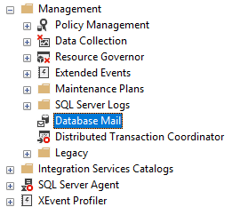
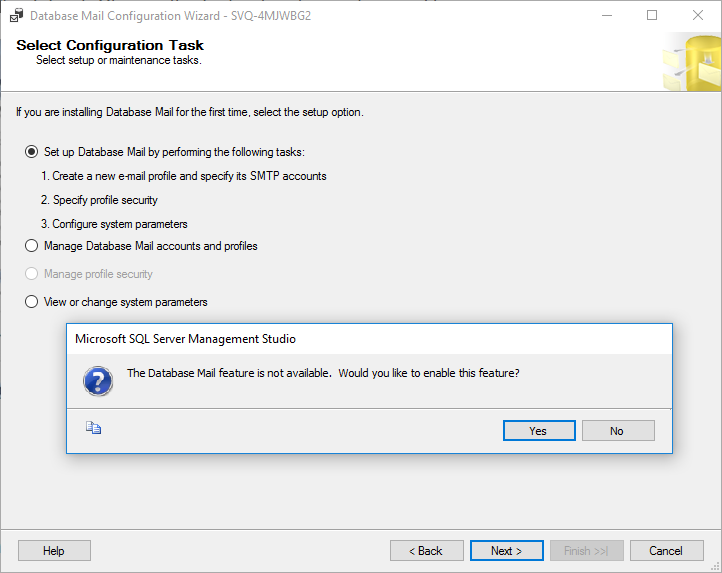
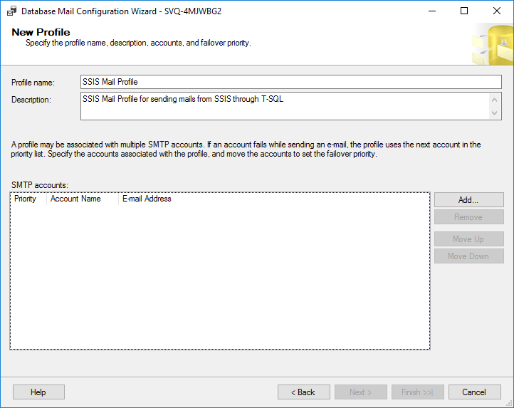
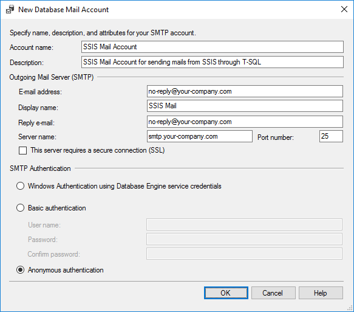

# T3ch Session: SQL Server Integration Service (SSIS)

## The ISP_04 package

The fourth **SSIS** package is based on the ISP_02 one reviewed in this lesson.

**Note** This package requires an operational mail server. To simplify the course, we have used the **Database Mail**. In this document you can find the section **The Database Mail** that collects the steps we have followed to set up this resource.

We have added an **Execute Process Task** to delete the **ZIP** output file and copy the **XLS** output template. The package extracts all the rows store in the **NewFactCurrencyRate** table using the **OLE DB Source** component and loads them to the **XLS** output file via an **Excel Destination** element. After that the **Excel** file is compressed using the **7zip** app (command line version). Finally, before sending by email the generated **ZIP**, the distribution list is retrieved from the **EmailDL** table storing the values in **SSIS** variables.

## The Database Mail

These are the steps we have followed to set up the Database Mail.

1. Open the **SQL Server Management Studio** (**SSMS**)
2. Go to **Management** > **Database Mail**
3. Right click and select the **Configure Database Mail**. The **Database Mail Configuration Wizard** should open.

	

4. Click on the **Next** button and choose the **Sep up Database Mail by performing the following tasks** option. Click on the **Next** button again.
5. Click **Yes** if the Database Mail feature is not available.

	

6. Enter the **Profile name** and the **Description**.

	- Profile name: SSIS Mail Profile
	- Description: SSIS Mail Profile for sending mails from SSIS through T-SQL

	

7. Click on the **Add** button to create a new database mail account. Here we are going to set the **Outgoing Mail Server** (**SMTP**).

	- **Account name**: SSIS Mail Account
	- **Description**: SSIS Mail Account for sending mails from SSIS through T-SQL
	- Complete the rest of the parameters according to your emails server.

	

	- Click on **OK**.
	- Click on **Next**.

8. Make your profile public or private and click on **Next**.
9. In the **Configure System Parameters**, keep the **Maximum File Size** (**Bytes**) to *1000000*. Click on **Next**.
10. Click on **Finish** and **Close**.

## Distribution Lists

We have created a table to store the **Distribution Lists** associated to each **SSIS** that requires to send mails.

- [ ] Creating the **EmailDL** table

``` sql
SET ANSI_PADDING OFF
GO
USE [AdventureWorksDW2012]
GO
SET ANSI_NULLS ON
GO
SET QUOTED_IDENTIFIER ON
GO
CREATE TABLE [dbo].[EmailDL](
	[EDLCode] [int] IDENTITY(1,1) NOT NULL,
	[EDLSSIS] [VARCHAR](255) NOT NULL,
	[EDLProfile] [VARCHAR](255) NOT NULL,
	[EDLTo] [VARCHAR](2000) NOT NULL,
	[EDLCc] [VARCHAR](2000) NULL,
	[EDLCco] [VARCHAR](2000) NULL,
 CONSTRAINT [PK_EmailDL] PRIMARY KEY CLUSTERED 
(
	[EDLCode] ASC
)WITH (PAD_INDEX = OFF, STATISTICS_NORECOMPUTE = OFF, IGNORE_DUP_KEY = OFF, ALLOW_ROW_LOCKS = ON, ALLOW_PAGE_LOCKS = ON) ON [PRIMARY]
) ON [PRIMARY]
GO
```

- [ ] Insert some data into the new table

``` sql
INSERT INTO [AdventureWorksDW2012].[dbo].[EmailDL] ([EDLSSIS], [EDLProfile], [EDLTo], [EDLCc], [EDLCco])
VALUES ( 'ISP-04', 'SSIS Mail Profile', 'to@email-account.com', 'cc@email-account.com', 'cco@email-account.com' );
```

- [ ] Retrieving the **DL** of the *ISP-04* package

``` sql
SELECT [EDLSSIS]
      ,[EDLProfile]
      ,[EDLTo]
      ,[EDLCc]
      ,[EDLCco]
FROM [AdventureWorksDW2012].[dbo].[EmailDL] (nolock)
WHERE [EDLSSIS] = 'ISP-04';
```

## Sending emails via **Dabatase Mail**

**Note** If you want to attach files, put them on a shared folder and grant read permissions to the appropiate users.

Use the next T-SQL code to test the e-mail.

``` sql
EXEC msdb.dbo.sp_send_dbmail
	@profile_name = 'SSIS Mail Profile',
	@recipients = 'to@email-account-1.com;to@email-account-2.com',
	@copy_recipients = 'cc@email-account.com',
	-- @blind_copy_recipients = '',
	@subject = 'Test from SSIS Mail Profile',
	@file_attachments = '<unit>:\<path>\Shared\SampleCurrencyData.txt',
	@body_format = 'HTML',
	@body = 'Please, find attached the retrieved data.';
```
