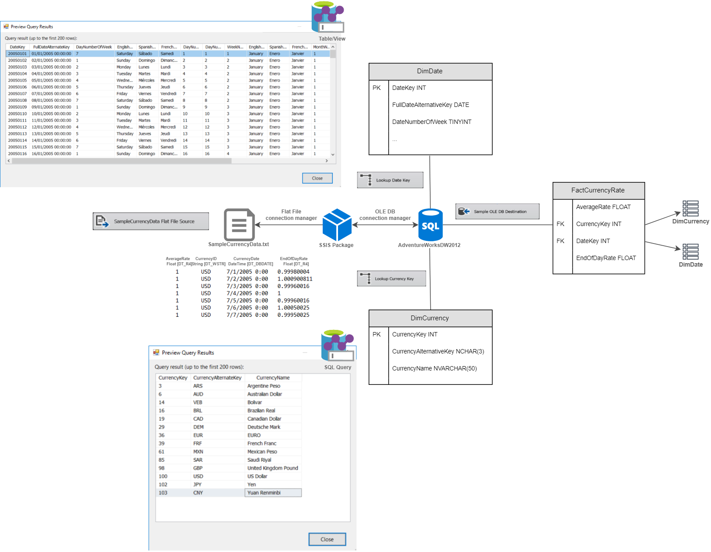

# T3ch Session: SQL Server Integration Service (SSIS)

## The ISP_01 package

The fist **SSIS** package is extracted from the [Lesson 1: Create a Project and Basic Package with SSIS](https://docs.microsoft.com/en-us/sql/integration-services/lesson-1-create-a-project-and-basic-package-with-ssis?view=sql-server-2017). It comments: *In this lesson, you create a simple ETL package that extracts data from a single flat file, transforms the data using lookup transformations and finally loads the result into a fact table destination.*

With the purpose of having a better compression of the function of this package, we have created the next diagram:

