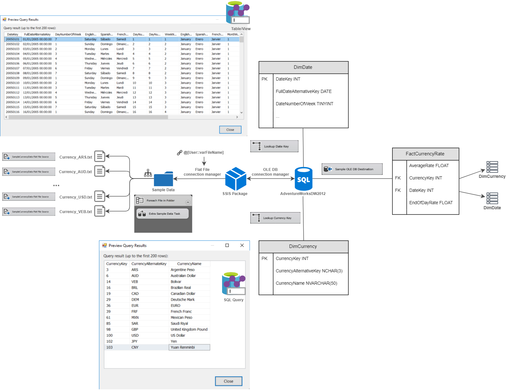

# T3ch Session: SQL Server Integration Service (SSIS)

## The ISP_02 package

The second **SSIS** package is based on the [Lesson 2: Adding Looping with SSIS](https://docs.microsoft.com/en-us/sql/integration-services/lesson-2-adding-looping-with-ssis?view=sql-server-2017). It comments: *In this lesson, you expand the package you created in Lesson 1 to take advantage of new looping features to extract multiple flat files into a single data flow process.*

However, we have added at the beginning of the control flow, an **Execute SQL Task** element that creates the **NewFactCurrencyRate** table if it does not exist or trucates its values. The package is based on the **ISP_01** one reviewed in this course. Apart of its functionally, a **Foreach Loop Container** has been added. It loops over the **Sample Data** folder and loads the content of the text files to the destination table. The new **varFileName** variable stores the filename of each of them in each iteration.

As we did in the first package, we have created the next diagram to have a clear idea of how it works.

